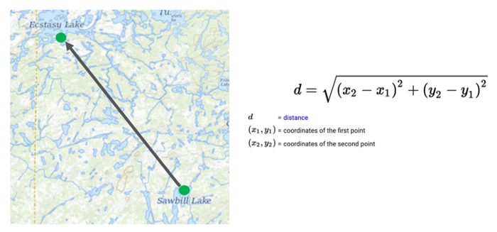

# Embeddings in an Enterprise Knowledge Graph

../img/embedding.png)

* What is an Embedding?
* Types of graph embeddings
* What are they used for?
* Creating embeddings

## What is a Graph Embedding?

[Vertex Embedding](vertex-embedding.png)

# References

1. [Understanding Graph Embeddings](https://dmccreary.medium.com/understanding-graph-embeddings-79342921a97f)