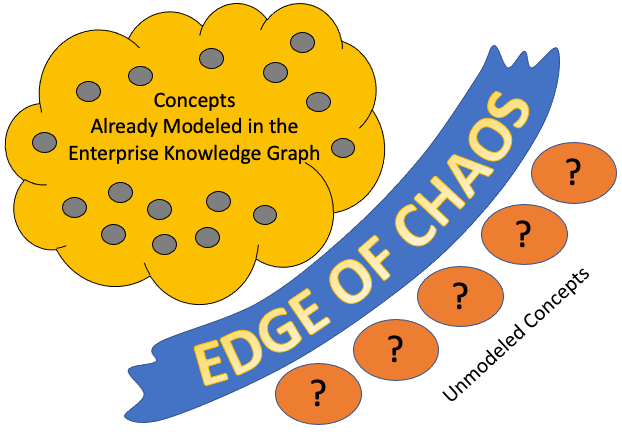

# Enterprise Knowledge Graph Glossary of Terms

#### ABox
Types of assertions or statements in a knowledge graph that conform to specific terminologies (knows as [TBox](#tbox) statements).  The terms ABox and TBox are used to help determine if a statement is universal or related to a specific [Subgraph](#subgraph) of an [Enterprises Knowledge Graph](#enterprise-knowledge-graph).

Within our Enterprise Knowledge Graph architecture, ABox statements often contain knowledge about specific customers, parts, or concepts and may have specific [Access Control](#access-control) rules.  TBox statements don't usually have these same access rules.

* See also: TBox
* [Wikipedia page on ABox](https://en.wikipedia.org/wiki/Abox)

#### Accumulator
A type of variable that tracks items as you traverse through a graph.  Accumulators can be global or be attached to a specific vertex.

Accumulators allow MapReduce style queries where each server node in a cluster does work in its local data and returns consolidated results to the query node.  For example, in the query *"count all customers that have returned clothing items"*, each node would return only a single count to the query node.  This type of query reduces the amount of communication between nodes in the graph cluster.

#### Alternate Label
In a [concept](#concept) [subgraph](#subgraph) of a EKG, every concept has a single preferred label (per language) and many alternate labels that can also be used to name a concept.  Alternate labels can be abbreviations, acronyms and synonyms of the concept.  In this glossary, alternate labels have a "Also known as" prefix.

* Also known as: atlLabel
* See also: [Preferred Label](#preferred-label)
* See also: [SKOS](#simple-knowledge-organizational-system)

#### Amazon Simple Storage System
A high-availability cloud-based [Key-value Store](#key-value-store) system created by Amazon in 2006.

In 2006 Amazon was a pioneer in the creation of cloud-based data services.  Because S3 was one of the first ultra-reliable cloud based services it gained early market share and now dominates the data storage industry.  The API for S3 is now duplicated by dozens of other vendors and has become a defacto standard for cloud-based key-value stores.

S3 was the first service launched as part of Amazon Web Services (AWS).

* Also known as: S3
* [Wikipedia page on Amazon S3](https://en.wikipedia.org/wiki/Amazon_S3)

#### Availability Heuristic
The availability heuristic suggests that the likelihood of events is estimated based on how many examples of such events come to mind.

For example, when a solution architect is presented with a business problem, their likelihood to recommend an enterprise knowledge graph solution is dependant on how many examples of successful enterprise knowledge graph project come to mind.  Surrounding solution architects with many successful stories or case studies of successful enterprise knowledge graph projects may positively impact their probability of recomending an enterprise knowledge graph as an option.

* See also: [Cognitive Bias](#cognitive-bias)
* [Wikipedia Case Study](https://en.wikipedia.org/wiki/Case_study#In_business)

#### A Priori and A Posteriori
A priori knowledge is that which is independent of experience. A posteriori knowledge is that which depends on empirical evidence.  The rules of mathematics, logic, and business rules are usually classified as a priori read-access is usually shared across all users of an enterprise knowledge graph.  Knowledge about a specific observable event, observation, customer transaction, etc. are considered A Posteriori and may not need to be universally accessed.

In an enterprise knowledge graph, a priori knowledge tends to be more universal such as TBox assertions that are universally accessible by all [subgraphs](#subgraph).
https://en.wikipedia.org/wiki/A_priori_and_a_posteriori

#### Automatic Sharding
The process of automatically migrating data from one server to another server in a distributed database.  Auto-sharding is frequently done as a database cluster grows or shrinks based on new data being added or removed from the cluster.

Auto-sharding is one of the key features that differentiate scale-out enterprise-class databases from departmental solutions.  Testing sharding at scale under continuous load in the face of possible hardware failure is one of the key challenges facing enterprise data architects.

#### Beam Search
A graph search algorithm that explores by expanding the most promising node in a limited set.

We use beam search to find [Concepts](#concept) in large language models to find facts about concepts.

Beam search is an optimization of best-first search that reduces its memory requirements. Best-first search is a graph search which orders all partial solutions (states) according to some heuristic. But in beam search, only a predetermined number of best partial solutions are kept as candidates. It is thus a greedy algorithm.

* [Wikipedia Page on Beam Search](https://en.wikipedia.org/wiki/Beam_search)

#### Big Data
An ambiguous term that many or may not refer to data sizes beyond the ability of commonly used tools to mange data.  If you used a spreadsheet, "Big Data" could be any data that does not fit into your spreadsheet.  If you use a Cray Supercomputer then your definition of Big Data could differ by ten orders of magnitude.  If we ever hear someone refer to "Big Data" we strongly suggest they use other terms that have more precise meaning.

* [Wikipedia Critique of Big Data](https://en.wikipedia.org/wiki/Big_data#Critique)

#### Bitermporal Modeling
A specific case of [Temporal Modeling](#temporal-modeling) modeling designed to handle historical data in two different timelines.  One timeline is concerned with when an event occurred in the real world and the other timeline is concerned when the data was recorded or corrected in a computer system. This makes it possible to rewind the information to "as it actually was" in combination with "as it was recorded" at some point in time. 

In order to implement this feature within an Enterprise Knowledge Graph, the data model must accommodate updates while preserving historical information. Information cannot be overwritten or discarded even if it is erroneous.  The consequence is more data must be retained even through only a small percentage of queries might require historical views of data.  Bitemporal models are more complex to query and require additional RAM and disk storage.
* [Wikipedia Bitemporal Modeling](https://en.wikipedia.org/wiki/Bitemporal_Modeling)

#### Brain Analogies
Explaining enterprise knowledge graphs in terms of the human brain.  Human brains have roughly 82 billion neurons and 10,000 connections for each neuron. This is known as a graph degree of 10,000.  Many enterprise knowledge graphs for the largest companies exceed 80 billion vertices but have only a handful of connections between them.
* See also: [Degree](#degree).

#### Business Event
A change in the state of a business entity within an operational source system that may be published to a downstream consumer such as an enterprise knowledge graph.

Business events are usually transmitted by [Change Data Capture](#change-data-capture) software and sent via document messages in formats such as JSON or XML.

* [Wikipedia](https://en.wikipedia.org/wiki/Event-driven_architecture)

#### Business Vocabulary
A collection of terms and phrases that have meaning to a specific domain of work.  A business vocabulary typically starts out with a flat list of terms in a spreadsheet. The terms are listed with their abbreviations and definitions and how they are used within a specific project or department.

As vocabularies grow and mature the individual terms might be grouped together.  These groupings become taxonomies and can then be used to automatically classify documents with metadata tags of their preferred labels.  Classified documents
can have a dramatic increase on the search quality of a search engine.

#### Change Data Capture
Software that detects changes in a database and transmits the change information via [business events](#business-event) to a remote system.  These events are often published on stream processing systems using the publish/subscribe integration pattern.

* Also known as: CDC
* [Wikipedia page on Change Data Capture](https://en.wikipedia.org/wiki/Change_data_capture)

#### Classification and Connection
Within the [data enrichment](#enrichment) pattern there are two distinct phases.  The first step is to take raw binary and numeric data streams and classify it according to the concept types in our knowledge graph.  Once we have business entities identified we next need to connect our business entities together using the context around them in the data.  These steps are called classification and connection.

* See also: [Knowledge Triangle](#knowledge-triangle)

#### Codifiable Knowledge
Knowledge that can be captured in machine readable formats such as taxonomies, ontologies, rules or decision trees and reused across an enterprise.

Codifiable knowledge is contrasted to [Tacit Knowledge](#tacit-knowledge) that can not easily be converted into machine readable forms and shared with others.  The process of converting tacit knowledge to codifiable knowledge is part of the field of [Knowledge Engineering](#knowledge-engineering) and [Knowledge Architecture](#knowledge-architecture).

Within an EKG, our focus is how to model and store codifiable knowledge in terms of graph structures such as taxonomies, ontologies and decision trees.

* Also known as: Explicit Knowledge
* [Wikipedia page on Explicit Knowledge](https://en.wikipedia.org/wiki/Explicit_knowledge)

#### Cognitive Bias
A systematic pattern of deviation from norm or rationality in judgment.

In this book we study why humans don't adopt enterprise knowledge graph technology and how we can use stories, demonstrations and economic reasoning to overcome these bias.

In this book we study several types of cognitive bias including:

1. [Anchoring bias](#anchoring-bias)
2. [Availability bias](#availability-bias) a.k.a. memory bias, familiarity heuristic
3. [Bandwagon effect](#bandwagon-effect)
4. [Confirmation bias](#confirmation-bias) a.k.a. Fiter bubble
5. [Halo effect](#halo-effect)
6. [Hindsight bias](#hindsight-bias)
7. [Illusory superiority bias](#illusory-superiority-bias)
8. [Framing effect](#framing-effect)
9. [Narrative-bias](#narrative-bias)
10. [Representativeness heuristic](#representativeness-heuristic)
11. [Status_quo_bias](#status-quo-bias)
12. [Sunk cost](#sunk-cost) a.k.a. Gamblers fallacy

[Wikipedia on Cognitive Bias](https://en.wikipedia.org/wiki/Cognitive_bias)

#### Concept
An idea, notion or a unit of thought.  Concept elements are the fundamental unit of work in semantics and are in integral part of enterprise knowledge graphs. 

In practice, each concept is usually associated with a vertex in a graph and has one preferred label in each language such as English.  Concepts may have many alternate labels.
Concepts are grouped in Schemas and may be part of one or more Collections.* 
[Concept Reference on W3C SKOS Site](https://www.w3.org/TR/skos-reference/#concepts)

#### Concept Graph
A graph that stores the core business concepts of a project, department or enterprise.  In the ideal world, an enterprise graph will use a combination of machine learning to connect related concepts together.

#### Concept Matching
The process of determining if two [Concepts](#concept) are semantically related.  When importing new data into an EKG, we must associate data element [Concepts](#concept) in an external data source to a well-known data element [Concept](#concept) in a canonical representation of an internal knowledge graph.

Concept Matching is done before data elements are converted to a normalized format in the Concept Mapping phase.  Together these steps are know as [Match and Map](#match-and-map).

When specific data sets are imported the sum of concept maps compromise a Schema Map.

A registry of Concept matches is called a [Metathesaurus](#metathesaurus).

* See also: [Wikipedia Page on Schema Matching](https://en.wikipedia.org/wiki/Schema_matching)

#### Concept Mapping
The process of converting external data representations of data elements into normalized formats within an enterprise knowledge graph.  Mapping is the second step in the data ingestion phase after data elements concepts have been [Matched](#concept-matching)

Together these steps are know as [Match and Map](#match-and-map).

#### Consilience
The principle that evidence from independent, unrelated sources can "converge" on strong conclusions.

Combining results from multiple scientific studies to form stronger conclusions than a single study, often called meta analysis, is an example of consilience.

One of the fundamental measures of the value of EKGs is can it promote concilience by linking datasets created from multiple independent data sources.

* Also known as: Convergence of evidence
* Also known as: Concordance of evidence
* [Wikipedia page on Consilience](https://en.wikipedia.org/wiki/Consilience)

#### Cost Sharing
The ability of a single graph data model to be shared by many business units and thus the costs can also be shared.  Lower charge backs make graph databases more cost-effective than other data models.

* See also: [No Complexity Penalty](#no-complexity-penalty)

#### Data Discovery
A process of discovering new patterns in large data sets using a combination of query tools, machine learning and often visualization.

Data discovery is contrasted with operational reporting which are regular consistent reports that are well known to users and good for spotting trends in datasets.

* Also known as: Data Mining
* Also known as: Knowledge discovery
* [Wikipedia page on Data Mining](https://en.wikipedia.org/wiki/Data_mining)

#### Data Ingestion
A process by which data is moved from one or more sources to a destination where it can be stored and further analyzed. The data might be in different formats and come from various sources, including [RDBMS](#relational-database-management-system), other types of databases, S3 buckets, CSVs, or from streams.

#### Data Lake
A data storage architectural pattern where data is stored its natural/raw format.  Data Lakes are a type of [key-value store](#key-value-store) where the key is a path to a file in a file system.

The Data Lake pattern was made popular with the Hadoop project.  Because Data Lake are simple they have the advantage that they can be easily implemented by distributed files systems such as [Amazon S3](#amazon-s3) object storage system or the [Hadoop Distributed File System](#hadoop-distributed-file-system) (HDFS).

Data Lakes are not considered a true database because the usually lack a query language, ACID transactions, indexing, caching, search, semantics, role-based access control.  Data Lakes are considered a source of data for EKGs.

#### Data Layer
An abstraction layer were low-level raw binary data is stored that contains information after analysis.

The Data Layer is the lowest level in the [Knowledge Triangle](#knowledge-triangle).

The format of data in the data layer may be narrative text or raw dumps from a relational database.

#### Dashboard
A set of views, usually presented on a single page, that display information as a set of key performance indicators and charts.  In general, dashboard views can be customized for a role or a specific user.

#### Datamart
A data warehouse used by a project or a department.  Decomissioning datamarts is a key cost-driver to the adoption of enterprise knowledge graphs.

#### Decision Tree
A way of storing business rules in a graph.  A decision tree contains a series of branches, each branch containing a conditional expression.  If the conditional expression returns TRUE, then a true link is traversed.  If the conditional returns FALSE and false branch is traversed.

Decision trees and the corresponding rules that are represented as pointer hops in an enterprise knowledge graph have many integration and performance benefits.

#### Denormalization
A strategy used in relational database design to increase performance for a large number of read-operations that access multiple tables using computationally expensive JOIN operations.  Denormalization is frequently used in [online analytical processing systems](#online-analytical-processing-system).

Although denomalization does increase performance, it also imposes a single departments requirements to optimize the reports relevant to their viewpoints.  Denomalization destroys the shareability of data models and thus leads to duplication of information and the increase of enterprise costs.  Decommissioning departmental [datamarts](#datamart) is a common way to justify the costs of building enterprise knowledge graphs.

* [Wikipedia page on Denormalization](https://en.wikipedia.org/wiki/Denormalization)

#### Degree
The degree of a vertex is the count of the number of connections between the vertex and other vertices.  The average degree of a graph is the average number of connections for a vertex.

For non-directional graphs, counting is one per edge.  For directional graphs that have reverse edges, each connection counts as two connections.  In a directional graph, each vertex has both an in-degree and out-degree.

#### Departmental Graph
A graph designed to store information from one or more departments of an enterprise.  Departmental graphs may be limited in that they can't be scaled up to hold enterprise data.

#### DIKW Pyramid
A visualization of the relationships between data, information, knowledge, and wisdom with data at the base followed by information, knowledge and finally wisdom at the top.

Although commonly used in the field of we don't use the DIKW pyramid visualization in this book because the top wisdom layer is confusing in the context of an enterprise knowledge graph.  We used the simpler three layer [Knowledge Triangle](#knowledge-triangle).

* [Wikipedia page on DIKW Pyramid](https://en.wikipedia.org/wiki/DIKW_pyramid)

#### Document Store
A type of database that stores data as tree-structured data elements such as JSON or XML.  Document stores use path-like query languages such as X-PATH to traverse the tree structure.  Languages such as XQuery provide high-quality functional programming languages with strong type checking.

X-PATH is a mature W3C standard for expressing path traversal using a rich array of standardized wildcard expressions.

#### DB Engines
A web site that harvests web documents that discuss databases and classifies the documents based on a taxonomy of database types.  The "Popularity changes per category report" is frequently cited in many graph presentations.

* [DB Engines](https://db-engines.com/en/ranking_categories)

#### Edge of Chaos
The edge of chaos is narrow band between order and disorder in [Complex Systems](#complex-systems) such as enterprise knowledge graphs.

In enterprise knowledge graphs we think of order as areas we have modeled and understand well.  We think of disorder as external areas that we have not yet modeled or we have determined that they are not worth the effort to model.  Enterprise knowledge graphs modeling teams are often working at the Edge of Chaos.  We use a combination of intuition and [Cost Benefit Analysis](#cost-benefit-analysis) to determine the business value of modeling a new area and ingesting the data into this new area.

* See also: [Complex Systems](#complex-systems)

#### Embedding
A data structure, usually a vector of decimal numbers, associated with an item in a graph, that helps users quickly find similar items.  Vertices, Edges, and Paths may all have embeddings.

#### Endogenic Knowledge
The knowledge that is modeled within your existing enterprise knowledge graph.

Finding out if your current endogenic knowledge can promote adequate recommendations and predictions is a key strategy in enterprise graph evolution.

In contrast, [Exogenous Knowledge](#endongenic-knowledge) is the knowledge that is not modeled inside your current knowledge graph.
* [Wikipedia page on Endogeneity](https://en.wikipedia.org/wiki/Endogeneity_(econometrics))

#### Emergence
When an entity is observed to have properties its parts do not have on their own, properties or behaviors which emerge only when the parts interact in a wider whole.

Emergence is a primary reason to build enterprise knowledge graphs.  Emergence allows us to find new insights in data that we could not find without connected data.  Unfortunately, there are few ways to predict the rate and value of insights that emerge when we connect new knowledge into an enterprise knowledge graph.  The value of emergence can be difficult to predict without a team that has experience with similar prior projects.
[Wikipedia Page on https://en.wikipedia.org/wiki/Emergence](https://en.wikipedia.org/wiki/Emergence)

#### Employee Graph
A graph representation of all your organization employees and their activities.  For each employee, the graph may contain items such as reporting structure, job titles, roles, work history, education, training, certifications, current skills, security access groups, goals, projects, tasks assigned, help desk tickets, bugs assigned, bugs fixed, inventions, desktop hardware, software being used, software licenses, emails, meetings, salary and performance reviews.

A detailed employee graph can be used to match available staff with new projects and find similar employees for career mentoring.  Employee graphs can also be used to predict the impact of employees that leave an organization, what employees work as ambassadors between groups, and what teams will be the most productive.

Due to confidentially reasons, sensitive employee data is often stored in a [subgraph](#subgraph) with specific [access controls].

* Also know as: Human Resources Graph
* Also know as: Human Capital Graph

#### Enterprise Knowledge Graph
A scalable graph database system used to store large-scale connected information for an entire enterprise.

By scalable we mean that it must be able to run on multiple servers as the graph expands.  Without scalability the graph might be considered a project or departmental graph.

For many large organizations, enterprise knowledge graphs typically have hundreds of developers doing concurrent loading and query development and the models can be dynamic. For example the Google Knowledge Graph team is thought to contain over 1,500 developers.

#### Entity Resolution
The process of finding records in a data set that refer to the same entity across different data sources.

Entity Resolution is a core technique in converting Information layer data into a consistent knowledge graph.

* [Wikipeia Record Linkage](https://en.wikipedia.org/wiki/Record_linkage)

#### Exogenous Knowledge
Knowledge “coming from outside” of your Enterprise Knowledge Graph.

Finding out what exogenous knowledge you need to make accurate predictions is an emerging area of enterprise knowledge graphs.

In economic modeling, exogenous events means an influence that arises from outside the scope of your model and that is, therefore, neither predicted nor explained by the model.

In contrast, [Endogenic Knowledge](#endongenic-knowledge) is the knowledge that is modeled within your enterprise knowledge graph.

* [Wikipedia page on Exogeny](https://en.wikipedia.org/wiki/Exogeny)

#### F-Score
A measure of the accuracy of a prediction or selection rule that takes both [Precision](#precision) and [Recall](#recall) into account.

Many teams are attempting to automatically extracting facts from text for transfer into a EKG continuously monitor F-score on their sample test data.  Continuous monitoring of F-Score is a key quality metric for automatic knowledge extraction from document collections.

* [Wikipedia F-Score](https://en.wikipedia.org/wiki/F-score()
https://en.wikipedia.org/wiki/Precision_and_recall

#### Force Directed Graph
A graph layout algorithm that simulates forces on springs that move items 
[Wikipedia Force Directed Graph Drawing](https://en.wikipedia.org/wiki/Force-directed_graph_drawing)

#### Fact Extraction
A form of information extraction that extracts specific facts from narrative text.  

Extracted facts can be directly linked to concepts in a Concept graph.

* Part of: [Natural Language Processing](#natural-language-processing)

#### Four Vs of Scalable Databases
Volume, velocity, variability and veracity are considered the four Vs that define scalable systems.  Volume refers to the total amount of data in our knowledge graph.  Velocity means that new inserts, updates and deletes might be coming in fast via streaming events and these events must be ACID compliant and still never slow down read access times.  Service levels agreements (SLAs) must focus not on total average times, but the averages of the slowest 5% of the transactions.  Variability means that data is not uniform and can be easily stuffed into a single fact table of an [OLAP](#online-analytical-processing-system) cube.  Veracity means we need to be able to validate the quality of incoming data in real-time and quickly raise warning flags if corrupt data is being transmitted into the EKG.

#### Forward Pass
The process of presenting input values to a neural network and data from the output layers.

Knowledge can be extracted from large language models such as BERT and GPT by presenting context and a desired object-relationships pair as an input prompt.  This is called a single forward pass query.

* [Language Models are Open Knowledge Graphs](https://arxiv.org/abs/2010.11967)

#### Glossary
A business vocabulary associated with a topic.  A glossary often has both general definitions of terms as well as contextual definitions for a specific domain or project.

* See also: [Business Vocabulary](#business-vocabulary)

#### GraphQL
A query language for APIs and a runtime for fulfilling those queries with your existing data.

Ironically, GraphGL has nothing to do with graph databases other than the fact that the queries often run much faster on graphs.  The name "graph" was used internally at FaceBook since they store their data in a graph structure.

One concern about GraphQL at the enterprise-scale is that your graph database should be able to detect GraphQL queries that are using too many resources.  This means your enterprise graph databases must understand concepts of [resource quotas](#resource-quotas).

#### Graph Query Language
A proposed standard graph query language being developed by the Working Group 3 (Database Languages) of ISO/IEC JTC 1's Subcommittee 32. 
GQL is designed to work with [Labeled Property Graphs](#labeled-property-graph).

* [Wikipedia GQL Page](https://en.wikipedia.org/wiki/GQL_Graph_Query_Language)

#### Graph Structured Query Language
A distributed graph query language developed by TigerGraph.  GSQL was designed to be syntactically similar to the SQL language
but it also integrated distributed query concepts that share patterns similar to MapReduce queries.

* Also known as: GSQL

#### Graph Database
A way of storing information in terms of vertices and edges.  Graph databases consider edge traversal as a primary performance consideration.  By storing edges as in-memory pointers graph databases offer roughly a 1,000x performance improvement over relational database management JOIN operations that must be calculated for each query.
See also: [Index Free Adjacency](#index-free-adjacency)

#### Graph Isomorphism
A graph can exist in different forms having the same number of vertices, edges, and also the same edge connectivity. Such graphs are called isomorphic graphs.

#### Hadoop Distributed File System
A high-availability distributed key-value store that was a principal component of the Hadoop system.

HDFS was one of the two components of the original Hadoop system.  The other component was the MapReduce system.
* Also known as: HDFS

#### Hedgehog vs Fox Modeling
Focus on accurate modeling a single domain or [subgraph](#subgraph) of an enterprise knowledge graph (the Hedgehog) vs general modeling of a wide variety of subgraphs or domains.

The term comes from [Archilochus](https://en.wikipedia.org/wiki/Archilochus) who stated "a fox knows many things, but a hedgehog knows one important thing".

There are pros and cons for taking different approaches.  No single strategy will work for all enterprise knowledge graphs at all times.  The involvement of subject-matter experts (hedgehogs) at different times in the lifecycle of an enterprise knowledge graph will impact the evolution of enterprise knowledge graphs.

#### Higher Order Knowledge
A height-related metaphor that is used to describe more abstract knowledge that is more universal in an enterprise knowledge graph.  The concept of "height" is related to the layers of the [Knowledge Triange](#knowledge-triangle).

For example, the idea behind "higher-order thinking" is that some types of learning requires more cognitive processing than others, but also have more generalized benefits.  Within knowledge graphs this may not translate into more CPU time for query traversal, but may depend on having more abstract vertices and edges in an upper or mid-range ontology.

* [Wikipedia page on Higher Order Thinking](https://en.wikipedia.org/wiki/Higher-order_thinking)

#### Index Free Adjacency
Accessing related entities in a system without having to consult a centralized index.  Using direct in-memory pointers to represent relationships is approximately three orders of magnitude faster than referencing a central index system.

* See also: The Neighborhood Walk Story

#### Information Layer
Data about our key business entities.  This includes Things, like People, Places and Events.

#### Inmon Data Warehouse
The Inmon Data Warehouse is a collection of database design patterns that promote analytics using relational databases promoted by Bill Inmon.

The Inomn approach was first enumerated in his 1992 book "Building the Data Warehouse".  The Inmon approach is usually contrasted to the more recent 2013 [Kimball Data Warehouse](#kimball-data-warehouse) that focuses on a simplicity and single fact table with many dimensions.

Many EKG projects can be funded by their ability to show they can decommission expensive Inmon-style data warehouses that don't have the flexibility of EKGs.

* [Wikipedia page on Bill Inmon](https://en.wikipedia.org/wiki/Bill_Inmon)

#### The Jenga Tower Metaphor
Within the context of the EKG, the Jenga Tower Metaphor is a story about how resilient any EKG systems is in the face of change.

In the Jenga tower game, a removal of a block lower in the tower should not cause the tower to collapse.  In the same way, a small change to the data model such as adding a property to a relationships should not cause graph queries to be rewritten.

[Labeled property graphs](#labeled-property-graph) (LPG) have a data model that prevents simple changes to the data model from requiring many queries to be rewritten.  Unlike SQL and RDF data models, LPG graphs don't suffer from the problems related to [Reification](#reification).

#### Key-Value Store
A type of database that stores items as pairs of keys and values.  The keys are strings and the values are binary blobs such as files or images.  A simple put/get/delete interface is used to manage the database.

Key-value stores are excellent complements to graph databases since their simplicity allows for low-cost-per-byte storage. 

#### Kimball Data Warehouse
A data warehouse design pattern that uses a single fact table joined with dimensional tables to minimize the impact of JOIN statements in reporting performance.

Kimball data warehouses are the ultimate in [denormalized database design](#denormalization).  Their goal is often simplicity at the expense of capturing complex relationship-intensive models of the world that can be reused across the enterprise.  As a result, Kimball datamarts  duplicate data in each department and each datamart has their own costs to perform [ETL](#extract-load-transform) operations.  In contrast, EKGs focus on highly [normalized] data models of the world that include many complex relationships.  This closer our models get to the real world the more they can be reused across many departments.

Decommissioning many departmental [datamarts](#datamart) is often a key way to justify EKG projects.
[Wikipedia Page on Ralph Kimball](https://en.wikipedia.org/wiki/Ralph_Kimball)

#### Knowledge Layer
A layer in the knowledge triangle that contains connected information.  The knowledge layer is often the top layer in our views.  There are some views that include a Wisdom layer on top of the knowledge layer.

#### Knowledge Graph
A set of interconnected typed entities and their attributes.

Entities can be any business objects, customers, products, parts, documents, employees or concepts.  Entities are usually implemented as vertices in a graph database and connected through edges.  In some types of graphs, for example [LPGs](#labeled-property-graphs), edges also have attributes.

Note that this definition has no dependence on semantics and inference.  Our definition is intentionally designed to include many types of interconnected datasets.  We think your organizational chart is a type of knowledge graph an may be a subgraph of your enterprise knowledge graph.

#### Knowledge Management
A multi-disciplinary field that include processes of creating, sharing, using and managing the knowledge and information of an organization.

Knowledge Management addresses question such as what is organizational knowledge, what types of knowledge are there ([Tacit](#tacit-knowledge) vs. [Codifiable](#codifiable-knowledge)), how do we encourage employees to capture and store knowledge is forms that can be reused, how do we motivate employees to link isolated knowledge islands together, how do we make tacit Knowledge more codifiable, searchable and reusable.

In this book, we take the approach that EKGs should be part of an organizations overall [Enterprise Knowledge Management] strategy and that individuals with formal training in the field of [Knowledge Engineering] should participate in the creation of EKGs and particpate in their evolution.

* [Wikipedia page on Knowledge Management](https://en.wikipedia.org/wiki/Knowledge_management)

#### Knowledge Representation
The process of representing information (individual facts) about the world in a form that a computer system can utilize to solve complex tasks.

Within the context of the enterprise knowledge graph, we used graph databases as our primary way to store knowledge and we complement graph databases with search engines and key-value stores when they are more efficient.  There is no single knowledge reprenstation that is ideal for all problems.

Graph database are the preferred way to store knowledge because efficient reasoning can be implemented as fast pointer-hopping operations that can be optimized by specialized hardware.

Knowledge representation is often the most complex challenge in the field of Artificial Intelligence.

* [Wikipedia Page on Knowledge Representation](https://en.wikipedia.org/wiki/Knowledge_representation_and_reasoning)

#### Knowledge Triangle
A stack of three layers that illustrates how knowledge graphs are constructed from raw data.  At the base is the [Data Layer](#data-layer) that stores raw binary data in numeric forms, above that is [Information Layer](#information-layer) that finds concepts and business entities within the data layer. At the top the triangle is the [Knowledge Layer](#knowledge-layer) where business entities are connected to make them easy to query using graph traversal algorithms.

* See also: The [DIKW Pyramid](#dikw-pyramid)

#### Narrative Level
The first stage in converting a rule from natural language, such as English, into an executable rule in a knowledge graph or other system.  A narrative rule may contain the following elements:

1. Source of rule (authority organization)
1. Area of focus (domain)
2. Scope
3. Context or setting
4. Recommendations or action to be taken
5. The population of items that are included
6. The population of items that ar excluded
7. Policy considerations (e.g. privacy, access, regulations)

Narrative levels may contain words or phrases that link to concepts in a [Concept](#concept) Graph.

See [Levels of Knowledge](#levels-of-knowledge)

#### Label
A string associated with one or more [Concepts](#concept).

Labels have two main types: [Preferred Labels](#preferred-lable) and [Alternate Labels](#alternate-lable).  Most formal ontologies and taxonomies only permit a single preferred label for each Concept in a given Language.

#### Labeled Property Graph
A graph data model where each Vertex and Edge have a single type and goth Vertices and Edges have attributes.
Both TigerGraph and Neo4j use the LPG data model.

* Also known as: LPG

#### Match and Map
The process of using [Matching](#concept-matching) [Concepts](#concept) from external sources to internal [canonical models](#canonical-model) and then [Mapping](#concept-mapping) the data into normalized formats using procedural code.

Machine learning can be used to accelerate both the Matching and Mapping process if a large data set of prior Matches and Maps are retained by an organization.

Matching and Mapping processes traditionally comprise over 50% of the cost of building the initial versions of enterprise knowledge graphs.

#### Load-As-Is Pattern
A data loading pattern that loads the data into a graph with minimal transformation.  Once the data is loaded
into the graph the transformation is done in the native language of the graph such as GSQL.  This pattern
allows many projects to share the underlying data loaders and allows each team to customize the post-loading transformation
using the native query language of the graph.  The other major data model is the RDF model which is discouraged at Optum due
to the challenges with Reification. Reification causes RDF SPARQL queries to be rewritten.

* [Load-as-is pattern](https://www.marklogic.com/blog/understanding-the-load-as-is-pattern/)
* See also: [RDF](#resource-description-framework)

#### Metathesaurus
A registry of linkages between semantically related concepts.

A metathesaurus is used to link concept ontologies together.  They can be used to accelerate data conversions from external to internal representations in a knowledge graph.

* [UMLS Metathesaurus](https://www.nlm.nih.gov/research/umls/knowledge_sources/metathesaurus/index.html)

#### The Neighborhood Walk Story
A story used to illustrate the difference between direct pointer hopping and using centralized indexes to traverse relationships.  The story uses a 30-second walk between two houses vs. an 8.2-hour walk to a central location and back.

#### No Complexity Penalty
Unlike relational databases, graph databases quickly traverse many complex relationships.  As a result, graph databases are better at modeling the real world - which is full of complexity.  We use the phrase "No Complexity Penalty" every time we are training people who have come from the relational world that worry that too many relationships will slow down their queries due to slow JOINs.

* See also: One version of the truth

#### One Version of the Truth
The real world has many complex relationships.  There are many ways to build simple models that take shortcuts to optimize queries by limiting relationships.  This is important in relational database modeling.  But the closer we get to modeling the real world, the closer to a single version of the truth we get.  Models that fairly represent the complexities of the real world can be reused among many business units and thus the costs of holding the information in memory can be shared.  This is why graph databases cost less then relational databases.

#### Online Analytical Processing System
An approach to answer multi-dimensional analytical queries quickly by minimizing JOIN operations in relational databases.  OLAP "cubes" often use a star schema with a central fact table and one JOIN operation per dimension of the cube.  The denomalization process used to create star schemas limits enterprise-sharing of these structures.

* [Wikipedia](https://en.wikipedia.org/wiki/Online_analytical_processing)

#### On-the-Wire vs. In-the-Can
A way of looking at knowledge representation requirements in two domains.  On-The-Wire implies that serialization of a dataset must retain connection information within itself and to other external systems.  In-The-Can knowledge representations are optimized for ease of query and [sustainability](#sustainability).  RDF is optimized for On-The-Wire exchange of knowledge.  LPG is optimized for In-The-Can tasks such as ease of query and sustainability.

#### Ontology
A graph of [Concepts](#concept) within a specific domain.  Ontologies often begin as flat term lists, that become taxonomies that then have more complex relationships than simple broader and narrower concepts.  Ontologies
are often stored in formats such as SKOS and OWL.

#### Open vs Closed World
https://en.wikipedia.org/wiki/Open-world_assumption
https://en.wikipedia.org/wiki/Closed-world_assumption

#### Operational Source System
A transactional computer that is the source of a data stream.  Enterprise Graph Databases often use [Change Data Capture](#change-data-capture) software on these systems to create an event stream of change records that so they can be stored in a central enterprise knowledge graph.  Change records are new, updated, or deleted business entities.

#### PageRank
A graph algorithm that is used to rank the most influential vertices in a directed graph.  For example, web pages in a graph of linked web pages.

PageRank was first used by Google Search to rank web pages in their search engine results.  The patent for PageRank (now expired) was purchased by Google from Stanford University for Google shares.  Those shares sold for over $336 million USD when Google went public.

* [Wikipedia](https://en.wikipedia.org/wiki/PageRank)
* Part of: [Graph Algorithms](#graph-algorithms)

#### Precision
Within the context of a knowledge graph, precision is the fraction of relevant facts or concepts extracted from a document that have been correctly identified and linked to concepts in a Concept graph.

Precision is part of an [F-Score](#f-score) that is used in a quality check for automatic knowledge NLP ingestion pipelines.

Both precision and recall based on an understanding and measure of [Relevance](#relevance).

* See also: [Recall](#recall)
* Also known as: positive predictive value
* [Wikipedia Precision and Recall](https://en.wikipedia.org/wiki/Precision_and_recall)
* Part of: [Natural Language Processing](#natural-language-processing)

#### Preferred Label
A preferred lexical label associated with a [Concept](#concept).  In the [SKOS](#skos) standard, there should be one and only one preferred label per language per concept.

* See also: [Alternate Label](#alternate-lebel)
* Part of: [SKOS](#skos)

#### Project Graph
A graph that supports a specific project.  Project graphs may contain knowledge that is not of interest to the rest of the enterprise.

#### Role-based Access Control
An design pattern for restricting system access to authorized users based on the roles they have been assigned.

RBAC systems are highly scalable and preferred by most large enterprises.  RBAC systems are scalable because creating individual relationships between a user an an application is too complex and difficult to maintain.

The following are the levels of RBAC within an EKG:

* Subgraph level RBAC - where roles restrict access permission (read, write etc.) to a subgraph
* Vertex level RBAC - where roles restrict access permission (read, write etc.) to each vertex of a graph
* Attribute level RBAC - where roles restrict access permission (read, write etc.) to specific attributes of a vertex or a property
* Query level RBAC - where only specific roles can execute a query

Enterprise scale graphs support vertex-level data access rules.  Although there are performance concerns implementing RBAC, most enterprise systems require this fine grain control.

* [Wikipedia Page on RBAC](https://en.wikipedia.org/wiki/Role-based_access_control)
* [Wikipedia Page on NIST RBAC](https://en.wikipedia.org/wiki/NIST_RBAC_model)

#### Reference Data
Reference data is data used to classify or categorize other data.  They typically are stored as a set of valid codes for a specific data element.

For example the list of [Country Codes](https://en.wikipedia.org/wiki/Country_code) is a type of reference data.  Reference data is often stored as a short code and a definition of what that code represents.

#### Reification
Reification is the process by which an abstract idea about a computer program is turned into an explicit data model or other object created in a programming language.

Within a graph,  reification is the process of turning a relationship into a vertex.

Specifically, in the RDF modeling process it is the process of adding an abstract vertex to a graph when properties are needed in a relationship.  Reification causes queries that traverse that node to be rewritten.  This means that SPARQL queries are inherently much more difficult to maintain than LPG graph queries.

* See also: [The Jenga Tower Metaphor](#jenga-tower-metaphor)

#### Resource Description Framework
An early family of standards developed by the World Wide Web Consortium for exchanging graph data championed by the [Semantic Web](https://en.wikipedia.org/wiki/Semantic_Web) community starting in 1999.  RDF gained some traction around 2010 but failed to gain widespread adoption due to the complexity of the standards and the problems of [Reification](#reification).
* [Wikipedia](https://en.wikipedia.org/wiki/Resource_Description_Framework)

#### Resource Quota
The ability to limit the resources consumed by a query such as CPU time, or RAM for individuals or groups.

Large enterprise-scale graph databases must carefully monitor and constrain queries that consume too many resources.  Many older technologies such as Apache Drill are difficult to implement without the ability to monitor and restrict resources.

#### Role-based Access Control
The ability to assign access to a resource to individuals that have a specific role.  For Enterprise Knowledge Graphs, there are both high-level subgraph rules and fine-grain rules such as vertex-related role-based access control.

#### Rules Engine
A software component that executes rules according to some algorithm.

In the Enterprise Knowledge Graph space rules are frequently represented in [Decision Tree](#decison-tree) structures within the graph.

* [Rules for Knowledge Graph Rules])https://dmccreary.medium.com/rules-for-knowledge-graphs-rules-f22587307a8f

#### Semantics
The branch of computer science associated with meaning.  It can be best understood by understanding the semantic triangle.  The key point of the semantic triangle is that we cannot directly associate a label with a referent without traversing concepts. 

#### Semantic Graph
A graph where each vertex represents a [Concept](#concept) and the edges of the graph represent the relationships between the Concepts.  The primary data model for storing semantic graphs is the [SKOS](#simple-knowledge-organization-system) data model where Concepts and [Labels](#label) are distinct types.

#### Semi-Structured Level
The second level of knowledge after facts have been extracted from narrative text and converted into a graph representation.

The layer is may contain items such as a [Decision Tree](#decision-tree), workflow diagrams, user stories, and personas that provide contextual and descriptive information about the steps involved in each recommendation or rule of the guideline.

1. *Source Vertex* - where did the rule originate
1. *Personas* - Who are the actors involved in the rule
2. *Concepts* - What are the concepts involved to restrict the population in the graph
3. *User Stories* - Functional descriptions of what happens from the perspective of each persona
4. *Processes* - Diagrams depicting the processes involved
5. *Triggers* - When do the processes happen (what are the entry points for the processes)

See [Levels of Knowledge](#levels-of-knowledge)

#### Shapes Constraint Language
A W3C standard RDF vocabulary for validating RDF graphs against a set of conditions.

Unlike document validation standards like XML Schema, SHACL assumes that data quality checks should be able to look for relationships in a graph as well as the local context of a document.  These conditions are provided as shapes and other constructs expressed in the form of an RDF graph.  LPG graphs do not yet have a version of SHACL.

* Also known as: SHACL
* [SHACL W3C](https://www.w3.org/TR/shacl/)

#### Simple Knowledge Organizational System
A model for expressing the basic structure and content of concept schemes such as thesauri, classification schemes, subject heading lists, taxonomies, folksonomies, and other similar types of controlled vocabularies. SKOS is also
the name of the world-wide-web standard for encoding these systems.  Serializations of SKOS are typically done in RDF format although other encodings such as XML and JSON are common.

* See Also: [W3C SKOS Primer](https://www.w3.org/TR/skos-primer/)
* See Also: [W2C SKOS Reference](https://www.w3.org/2009/08/skos-reference/skos.html)

#### Stages of Knowledge Extraction
The four primary stages of knowledge representation from Narrative, Semi-structured, Structured and Executable.

There are three transformations of Knowledge Extraction so that knowledge can be represented in standardized forms and executable on different systems.

* See also: [Narrative](#narrative)
* See also: [Semi-Structured](#semantic-structured)
* See also: [Structured](#structured)
* See also: [Executable](#executable)
* Part of: [Natural Language Processing](#natural-language-processing)
* [FHIR Levels of Knowledge](http://hl7.org/fhir/uv/cpg/2019SEP/documentation-approach.html)
* 

#### Strategy Graph
A graph that is used to help determine what strategies might be optimal for an enterprise or a subgroup as well as how organizations are performing on a specific strategy.

To be successful, enterprise and departmental strategies must be encoded in machine-readable forms such as [StratML](https://en.wikipedia.org/wiki/Strategy_Markup_Language) and loaded into an enterprise knowledge graph.

Strategy graphs can also be used to determine the alignment of proposed projects for the future in an organization.

StratML encoding is sometimes required of US federal organizations so that strategies can be analyzed by published public documents.

* [Wikipedia Page on StratML](https://en.wikipedia.org/wiki/Strategy_Markup_Language)

#### Strategic Serendipity
Building a enterprise strategy around the creation of an environment where it is easier to make unexpected connections between items.  Strategic serendipity involves getting a large number of people ready to discover new things in an enterprise knowledge graph.

#### Structured Stage
A computable and standardized representation of a business rule that and can be shared with other organizations.

Unlike the prior semi-structure stages, this stage must adhere to standards within an industry and each node in a decision tree must link to well known concepts with concept IDs.

* Complete value sets specified using standard terminologies
* Data element definitions describing the information involved
* Computable logic describing at least the inclusion/exclusion criteria
* Structured recommendations in the form of event-condition-action rules
* Structured process definitions describing how the recommendations fit into a clinical workflow
* Structured form definitions providing a conceptual description of the user-interfaces involved
* Part of: [Natural Language Processing](#natural-language-processing)

#### Subgraph
A subset of an enterprise knowledge graph that may store specific types of knowledge and may have specific access control rules based on the role of a user.

For example, a business glossary, taxonomy, ontology or business rules system that contains no customer-specific information may be in one subgraph and have universal read-access for all users.  Customer-specific data that is highly confidential may be stored in a different subgraph, with read access only granted on a need-to-know basis.

* See also:[Role Based Access Control](#role-based-access-control)

#### Sustainability
The ability for an enterprise knowledge graph achieve unquestionable ongoing value to an organization in hhe face of constant change.

Changes include new data being added, new types of data being added, new users, new usage patterns and new applications using the enterprise knowledge graph.  Strong EKG architectures are resilient to these changes.

Many organizations measure sustainability as the ability of a central IT organization to charge independent business units recurring [chargeback](#chargeback) fees to use the EKG.

The key measure is to avoid problems related to rewriting graph queries when small changes are made to the graph data model.

* See also: The [Jenga Tower] Story

#### Systems Thinking
A way of looking at problems in terms of components that interact with each other over time using direct connections, indirection connections and both positive and negative feedback cycles.  Systems Thinking forces us to think broadly about how our enterprise knowledge graphs interact with external systems.  Systems thinking also helps us see the unintended consequences of our actions.

#### Tacit Knowledge
A type of knowledge that is difficult to codify in terms of a machine readable artifacts that can be reused across an enterprise.  Tacit knowledge is difficult to transfer from one person to another person by means of writing or verbalizing.

Understanding what tacit knowledge is developing strategies to convert it to codifiable knowledge is a key areas of research in the fields of [Knowledge Management](#knowledge-management) and [Knowledge Engineering](#knowledge-engieering).

* See also: [Codifiable Knowledge](#codifiable-knowledge)
* [Wikipedia Page on Tacit Knowledge](https://en.wikipedia.org/wiki/Tacit_knowledge)

#### TBox
A "terminological component" or terminology [Concept](#concept) associated with a set of facts assertions (ABox statements) of a knowledge graph.

TBox statements tend to more rules or metarules (rules about rules) that individual fact about customers or other business entities.
* See also: [ABox](#abox)
* [Wikipedia Tbox page](https://en.wikipedia.org/wiki/Tbox)

#### Technology Adoption Life Cycle
A sociological model that describes the adoption or acceptance of a new product or innovation, according to the demographic and psychological characteristics of defined adopter groups.
* [Wikipedia](https://en.wikipedia.org/wiki/Technology_adoption_life_cycle)

#### Temporal Modeling
The process of modeling time in a data model.  Modeling time can be complex when the requirements of a system require you to be able to recreate detailed reports as they were at a prior point in time. Temporal modeling includes the concept of versioning and [bitemporal modeling](#bitermporal-modeling)

#### Triple Store
A purpose-built database for the storage and retrieval of RDF triples through semantic queries.  Triple stores are not used in most enterprise graphs due to their lack of [sustanability](#sustanability) due to problems with [Reification](#Reification).
https://en.wikipedia.org/wiki/Triplestore

#### Upper Ontology
General high-level [Concepts](#concept) that are common across all domains in a knowledge graph.  Concepts such as Organization, Customer, Family Unit, Product, Part, Invoice, Document are often consider part of an upper ontology.  Enterprise graphs may contain multiple ontologies and the ease of linking ontologies in highly dependant on sharing upper ontologies.
* [Wikipedia Page on Upper Ontology](https://en.wikipedia.org/wiki/Upper_ontology)

#### Web Ontology Language
A Semantic Web language designed to represent rich and complex knowledge about things, groups of things, and relations between things.
* [W3C OWL Web Site](https://www.w3.org/OWL/)

#### Window of Opportunity
A narrow band of time that an organization might be ready to adopt a new technology such as an enterprise knowledge graph.

To arrive at the Window of Opportunity to adapt an enterprise knowledge graph an organization must meet a set of preconditions such as an internal chamption, a shared understanding of what enterprise knowledge graphs are capable of, and the ability to ingest enough information to achieve specific business objectives.  Enterprise knowledge graphs then have a limited time to create a pilot project before funding runs out, champions move on, or alternative technologies get mindshare.

Very often a specific chrisis can trigger an unexpcted window of opportunity.

Knowing how to recognize these windows and take advantage of them is a key skill we attempt to explore in this book.

* [Wikipedia article on Window of Opportunity](https://en.wikipedia.org/wiki/Window_of_opportunity)

