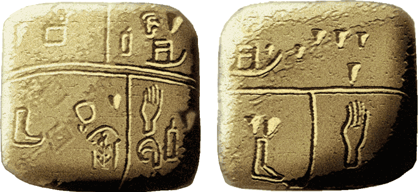
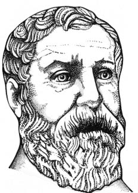
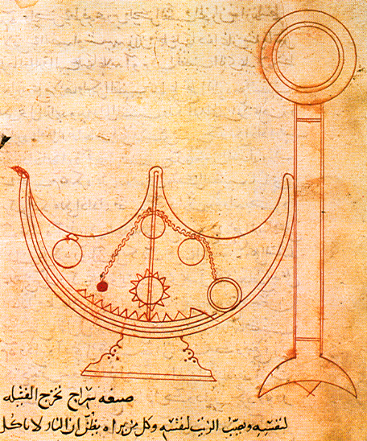
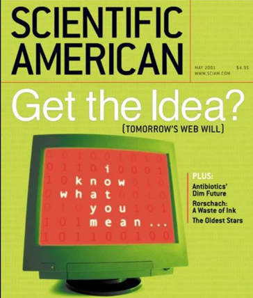
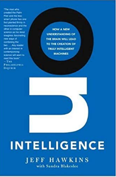
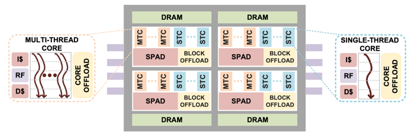

# Enterprise Knowledge Graph Timeline

* Pattern Matching: Tabs vs. Rels
* Tabular vs. Relationship Thinking
* Historical Events that

## Pattern Matching in our Brains
Our brains are fantastic machines for finding patterns around us and using these patterns to predict future events.  If I show you a photo of a famous movie actor, within 50 milliseconds your brain will easily **"recognize"** the actor even though you may have seen thousands of movies and can recall 10,000 faces of other actors.  You don't recognize faces consciously.  You don't go through each of the 10,000 actors you have seen and ask yourself, **"Is this photo of this actor.  The eyes are similar but the chin is not as round.  I will give it a low score and move on to the next actor I know."**.  Your brain does the matching in parallel unconsciously and you can't prevent this matching process from happening.

In a similar way, when presented with a new business problem, your brain will unconsciously start to match this new problem with every other business problem you have encountered in the past.  You can't prevent this from happening.  But what you can control is the number and types of problems-solution pairs you hold in your brain.  You can learn how to recognize new problem-solution pairs.

## Tabs vs. Rels: The Battle for your Mind
Imagine there are two memes battling for control over your mind.  The "tabs" meme is the choice of **"tabular convenience"**.  It is all the factors that want us to believe that knowledge of our complex world fits easily into tabular representations of data.  The second force of "rels" is **"relationship truth"**, where we realize that our world is full of complex relationships and to be effective we need to faithfully model these relationships as connected graph networks.

These two forces are constantly at work in our brains, but we are rarely conscious of it.  The goal of this chapter is to help you become aware of these forces and use conscious thought to help you weight the evidence and make the right match.

## Putting graph representations of knowledge in historical context

Here is a timeline of significant events that have led to the creation of the enterprise knowledge graph.  We focus on how the representation of knowledge impacted the way that problems were solved.  We focus on understanding the momentum of various design patterns and the innovations that allowed scale-out knowledge representations.

There are two forces at work.  One is the force of **"tabular convenience"**.  It is all the factors that want us to believe that knowledge of our complex world fits easily into tabular representations of data.  The second force is **"relationship truth"**, where we realize that our world is full of complex relationships and to be effective we need to faithfully model these relationships as connected graph networks.

## First Forms of Knowledge Storage: Brain Evolution
Lets take a step back and see how brains evolved to store knowledge.  Centralized nervous systems may have first evolved around 521 million years ago.  They probably evolved from simple [Nerve Networks](https://en.wikipedia.org/wiki/Nerve_net) which consisted of specialized cells that worked together to process information.  All networks that process information can be modeled by graph databases.  Score one point for relationships.

What is interesting to note is that higher life forms never have evolved information processing systems that use tabular data storage.  This is an artificial construct that evolved from writing systems.

 [Wikipedia page on Brain Evolution](https://en.wikipedia.org/wiki/Evolution_of_the_brain)

## Cuniform Tablets
Around 3,000 BCE in the fertile crescent, a group of farmers started to record transactions as rows in clay tablets.  Despite its limitations in storing relationships, for the next 5,000 years, tabular representations of data became the dominant way to store and transmit knowledge.

This was the first known case of persistent data representation.  Although the transactions were initially simple, they started in motion a long change of representing data in tabular structures.  A process that still exists today.  Score one point for tabular convenience.

## Hero of Alexandria
Hero is known to have created the first devices that store information on mechanical devices that control the playback of sequences of effects such the motion of statues and sounds.  This was one of the first forms of machine readable knowledge.  His inventions were powered by a binary-like system of ropes, knots, and simple machines operated by a rotating cylindrical cogwheel.  We can't say if he used tabular representations of event data.

[Hero of Alexandria](https://en.wikipedia.org/wiki/Hero_of_Alexandria)

## Book of Ingenious Devices
A large illustrated work on mechanical devices, including automata, published in 850 by the three brothers of Persian descent, known as the Banu Musa.  This book was a collection of best practices for storing and playing back information.  Since we don't really know much about these devices we can't give points to either side.

* [Book of Ingenious Devices](https://en.wikipedia.org/wiki/Book_of_Ingenious_Devices)

## Bookkeeping

Around 1494, Luca Bartolomes Pacioli published a widely read book on a variety of mathematical topics that included the principals of double-entry bookkeeping.  This type of record-keeping used various columns in tables to record financial transactions.  Score one point for tables.

* [Wikipedia on Summary of Arithmetic](https://en.wikipedia.org/wiki/Summa_de_arithmetica#Bookkeeping_and_finance)

## Looms
Basile Bouchon developed the punch card as a control for looms in 1725.  These inventions were further refined in the Jacquard Machine.  These devices allow the concepts of machine-readable information devices to be created.  Score one point for tables.

[Wikipedia Jacquard Machine](https://en.wikipedia.org/wiki/Jacquard_machine)

## Leonhard Euler Invents Graph Theory
In 1736 Euler invented graph theory while pondering the problem of walking around the city of Konigsberg.  By reducing the topology of the city, the rivers and islands to a graph he showed that you could not walk through the city and cross each of those bridges once and only once.
Score one point for relationships.

![]
[Seven Bridge of Koningsberg](https://en.wikipedia.org/wiki/Seven_Bridges_of_K%C3%B6nigsberg)

## Punched Cards
In 1890 Herman Hollerith developed punched cards for use in commercial data processing. These cards became the backbone of machine readable information storage until core memory was invented.

It is interesting to note that both programs and data were stored on punch cards.  Early batch programmers would submit both data decks and program decks together and return the following day to see the results of their programs often printed in additional card decks.

At the time, storing data on rectangular cards was an extremely practical decision.  It made it easy to build hardware to store and read information.  An unfortunate consequence was that for the next 125 years many people were taught that data within a computer's memory must also have this format.

[Wikipedia on Punched Cards](https://en.wikipedia.org/wiki/Punched_card)

## Flat File Databases
The earliest databases were usually modeled using the same data structure as punch cards: data loaded one row at a time.  The layout of fields within the cards might be fixed with or variable width depending on the type of data being stored.

The predominant language for information processing was COBOL for business and FORTRAN for scientific computing.  Both these languages used functions that read and wrote flat file data.

[Wikipedia Flat File Database History](https://en.wikipedia.org/wiki/Flat-file_database#History)

## Relations Added to Flat Files
In 1970 the concept of adding relationships to flat files was codified into a new type of database appropriately called "Relational" databases.  Although the name "relational" was used, fast relationship traversal were not a primary concern.  The system required all rows of both tables to be fist analyzed before the relationships could be discovered when a query was executed.

We should note that here were several early efforts to create databases that relied on fast in-memory pointer management.  These were called Navigational Databases because to follow relationships you had to navigate a network of pointer references.  Although many of the concepts in these databases continued to mature in path traversal languages such as [XPath](https://en.wikipedia.org/wiki/XPath) and [XQuery](https://en.wikipedia.org/wiki/XQuery), they did not catch on due to the difficulty of migrating away from the reliance on flat files as the predominant way of storing data.

[Wikipedia Navigational Database](https://en.wikipedia.org/wiki/Navigational_database)
[Wikipedia Relational Database History](https://en.wikipedia.org/wiki/Relational_database#History)

## Inventions of Spreadsheets
In 1979 Dan Bricklin and Bob Frankston implemented VisiCalc on the Apple II.  It was one of the first affordable spreadsheet programs for personal computers.  This allowed anyone with a personal computer to perform complex calculations on their desktop computer.  Spreadsheets allowed almost anyone with minimal training in programming to create complex financial analysis using simple equations that referenced other cells in a table.  

It is a bit ironic that the data structure behind spreadsheets is a dependency graph.  Every time the value of any cell changes, any calculations that depend on that cell are executed and the new cell values updated.

Score one point for tabular convenience.

[Wikipedia](https://en.wikipedia.org/wiki/Spreadsheet#History)

## Resource Description Format (RDF)
The need to store relationships between information was addressed by Ramanathan V. Guha and Tim Bray starting around 1995.  A first public draft of RDF appeared in October 1997 as part of standards promoted by the World Wid Web consortium.

The RDF data model was a brilliant development but was widely misunderstood due to poor understanding of its potential.  Many thought it was only for storing metadata or for storing data within a database.  In reality it's strength was a robust standard method for serializing complex knowledge in a portable format.  Score one point for relationship thinking.

## The Semantic Web
In May of 2001 Scientific American published an article on the Semantic Web.  This article launched and entire industry of companies that wanted to use connected data to power AI systems.  The standards did allow anyone on the web to publish knowledge that could be easily linked into an knowledge graph.  But the stack of tools built on top of RDF had many issues with sustainability and have never gained widespread commercial adoption in most large corporations.  Score one point for relationship thinking.

## Jeff Hawkins Publishes "On Intelligence"
In 2005, entrepreneur and brain researcher Jeff Hawkins published the groundbreaking book [On-Intelligence](https://en.wikipedia.org/wiki/On_Intelligence).  Although Hawkins was known for his invention of the PalmPilot, his passion was understanding the overall architecture of the human brain.  Hawkins made many connections between computer science and the brain showing how the network structures of the brain that reflects the true structure of the world.  Hawkins put the responsibility of AI researchers not only on developing algorithms for predicting future events, but for accurately modeling the world with networks and using this structure to predict future events.  His famous quote was **"The key to artificial intelligence has always been representation."**.  Score one point for relationship thinking.

## Neo4j: The First Labeled Property Graph
In May of 2007 Emil Eifrem committed the first labeled property graph data model as an open-source in-memory Java library.  Version 1.0 of the Neo4j database was released in February 2010.  Unlike the RDF model that did not allow relationships to have properties, the LPG model allowed every relationship to have any number of properties.  This meant that adding a property to a relationship did not require you to refactor the graph structure (Reification) causing all queries to be rewritten.  We finally had a sustainable data model that allowed the models to gracefully grow as complexity grew.

Neo4j also kept their in-memory model simple which allowed simple pointer hopping operations to be used to traverse the graph.  This is a key to performance, and will enable future hardware optimizations.   Score one point for relationship thinking.

[Neo4j First GitHub Commit May 2007](https://github.com/neo4j/neo4j/commit/6a945ab06a928bbd0f93dc56af279ee35107d7c3)

## The Google Knowledge Graph
On May 16, 2012, Google published the "Things Not Strings" blog post.  Now the world knew that graphs were no longer an academic interest. Google's graph serviced millions of requests per minute and was available 24X7.  Knowledge Graphs became cool.

[Introducing the Knowledge Graph: things, not strings](https://www.blog.google/products/search/introducing-knowledge-graph-things-not/)

## TigerGraph Releases the First Distributed LPG
Although the Neo4j system was innovative for it's time, it was built around a memory model that did not include queries that spanned multiple servers.  In 2017 TigerGraph release a version of a native labeled property graph that was designed from scratch to take into account distributed queries.  This allowed it to have robust scale-out performance to large clusters to meet the needs of large enterprise-scale applications.

## Hardware Graph
In 2020 we saw the growth of hardware solutions that have been customized to meet the needs of graph databases.  [Graphcore](https://en.wikipedia.org/wiki/Graphcore) produced new custom silicon chips that were ideal for graph parallel traversal.  Xilinx created custom additions to TigerGraph that allowed graph [similarity algorithms](https://developer.xilinx.com/en/articles/cosine-similarity-using-xilinx-alveo.html) to be performed orders-of-magnitude faster than using standard processors.  And finally, in October Intel published their landmark PIUMA architecture that is finely tuned to the needs of graph traversal.

