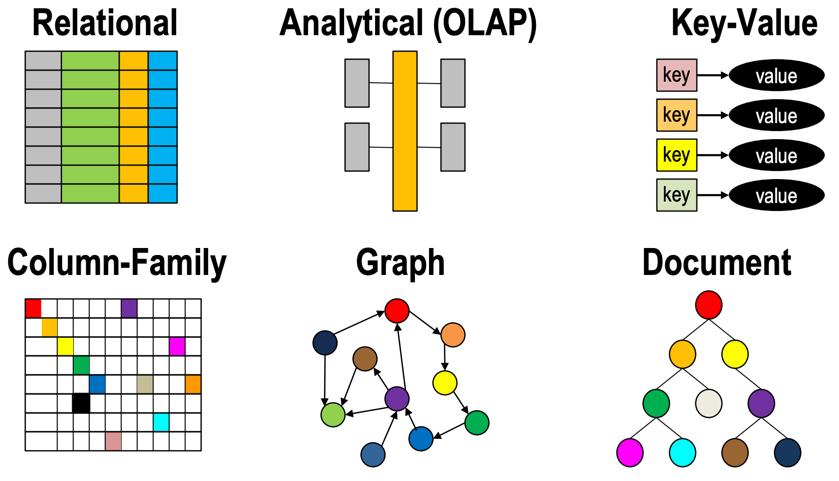

# Chapter 1: What is an Enterprise Knowledge Graph

[**Knowledge is Power - Imam Ali (AD 599-661)**](../references.md#knowledge-is-power)

1. Graphs are a NoSQL architectural patterns
1. Defining enterprise knowledge graphs
2. The Role of architectural scalability
3. Growth Rates of graph databases technology
4. Scale out graph database hardware
5. Scale out graph query languages

## Graphs are a NoSQL Architectural Patterns

Enterprise Knowledge Graphs (EKGs) are a type of [graph database](glossary.md#graph-database) that are designed to scale to meet the demanding requirements of large organizations.  Graph databases are just one type of NoSQL database architectural patten that we use to solve business problems.  EKGs are also frequently used in combination with other NoSQL databases since each architecture has its strengths and weaknesses.

If you are a [solution architect](../glossary.md#solution-architect) your job is to work with business units to find how to correctly match business problems to the right NoSQL database architecture pattern.  This book will help you determine if EKGs might be a good fit for one or more of your business areas.

Although they have become popular, it is critical that we don't begin to think EKGs are the only solution to business problems.  Solution architects must have a strong understanding of all NoSQL architecture patterns to keeping recommendations objective.  They must know the pros and cons of each of these architectures.  Although it is out of the scope of this book to do a deep dive into each of the six architectural pattern, we present each of them here briefly so you can explore more on your own.  The six types of NoSQL database architectural patterns are described in Figure 1.1.

The six key architectures are:

1. **[Relational](../glossary.md#relational-database)** - where data is stored as fixed format rows in tables and new data is added one row at a time.  Relationships between tables are calculated at query time using JOIN statements that require central indexes to be used to traverse the relationships.  Ironically, relational databases put relationship traversal as a secondary concern and don't optimize the design for fast traversal of billions of relationships.  Because relationships evolved as an "add on feature" to COBOL flat files running on mainframes, the focus of a relational database is fast atomic transactions on row-oriented data.  Also known as row-stores.
2. **[Analytical](../glossary.md#analytical-database)** - where data is stored in centralized fact tables with simple relationships to dimensional tables.  Dimensions each represent a way you classify the facts in the fact table.  Analytical databases severely restrict the number of JOIN operations to optimise performance but force everyone to agree on the dimensions used to classify data.  Analytical databases tend to be the most difficult to use between departments since the [denormalization](glossary.md#denomalization) process can be very specific to a single departments view of the enterprise.
3. **[Key-value Store](../glossary.md#key-value-store)** - a very simple type of data storage system that is deliberately designed to be simple so it can easily scale. Key-value stores have a simple API (store, get and delete) and the salient fact is that you cannot efficiently query the content of a value. It is considered a back box or "binary blob" of information.  Because if the simple design of key-value stores they are easy to distribute over a large cluster of computers and are cost effective when measured annual cost per terabyte per year.  They are an ideal complement to EKGs since EKGs focus on minimizing RAM usage.  EKGs frequently store just the key portion of items such as images or document references.
4. **[Column-family Store](../glossary.md#column-family-store)** - these databases are similar to key-value stores but they partition the key into multiple components such as a row and column portion of the key.  A spreadsheet is a good example where a key is a cell at to get to the cell you must have the row and column identifiers of the cell.
5. **[Graph Database](../glossary.md#graph-database)** - a database composed of vertices and edges, both with attributes, where relationship traversal is a primary concern, not an afterthought.  The graph database architecture pattern is the foundation for all enterprise knowledge graphs.
6. **[Document Store](../glossary.md#document-store)** - a database that is composed of recursive tree-like structures where the atomic unit of storage is branches and leaves of this tree.  Document stores proved path-like query languages to reach any points in a tree using simple path expressions that may contain wildcards.  Document stores are ideal when you have hierarchial tree-like data such as documents or serialized objects that contain other objects.  Both XML and JSON are considered data models to serialize document structures.  Document stores are ideal for document search and retrieval since they can use document structure to aid in relevancy ranking.

These six database architecture patterns are frequently used with the [Architecture Tradeoff Analysis Method](../glossary.md#architecture-tradeoff-analysis-method) (ATAM) to help organizations have a transparent discussion on the pros and cons of each alternative.  A high-level overview of the ATAM process is shown in Figure 1.2:

## Defining Enterprise Knowledge Graphs

In this book, we define Enterprise Knowledge Graphs as the following:

**An Enterprise Knowledge Graph is a scalable graph database that stores information from two or more departments of an organization.**

You will note that this definition is both somewhat general and very specific.  It is general because it includes many graph projects using a wide variety of technologies.  It is very specific in that it requires whatever graph database being used to have scalable technology under the hood.  We have very specific rules about what we mean by enterprise scalable.  Unfortunately, this eliminates most departmental graph projects in use today that don't use true scale-out technologies.

Why do we define EKGs with scalability as a prerequisite?  Because to truly meet the future needs of a large enterprise we must build our graph pilot projects on an infrastructure that will not fall over and die as it grows beyond the initial pilot phase.  I have seen many well intentioned software architects claim to be building enterprise-scalable graph databases only to have the projects fail due to performance problems as they grow beyond their early stages.

We also exclude knowledge graphs that are only attempting to solve problems for a specific department or specific business unit.  These can still be valuable projects for an enterprise since they can help individuals and departments learn the capabilities of graph databases.  But we would still classify them as departmental graph project, not enterprise-scale graph projects.

Now let's take a closer look at what we mean by enterprise scalable.

## Enterprise Scalable Knowledge Graphs
Scalability is an inherent characteristic of any database architecture.  It implies that as the size and complexity of the databases grows, the architecture must accommodate this growth without rewriting the core applications.  Although unexpected performance problems with specific queries might occur as the size of your database grows, they should be fixable by doing simple query optimization.  To be a true EKG pilot you should never have to redo your architecture from scratch.  You should be able to know that the exact same queries should run on ten thousand vertex graph and a trillion vertex graph.

The key aspect of scalable graph databases is the ability to distribute a graph over a large number of independent but closely connected servers in a data center.  As demands grows, the number of servers in the cluster must easily scale without users or operations being impacted.  As you add new servers data must automatically be redistributed over the new servers in the cluster.

### Scalability Means the Four Vs
Volume, velocity, variability and veracity are considered the four Vs that define scalable systems.

**Volume** refers to the total amount of data in our knowledge graph.  For example enterprise-scale graphs may easily contain over 10 billion vertices and 50 billion edges. 

**Velocity** means that new inserts, updates and deletes might be coming in fast via streaming events and these events must be ACID compliant and still never slow down read access times.  Service levels agreements (SLAs) must focus not on total average times, but the averages of the slowest 5% of the transactions.

**Variability** means that data is not uniform and can be easily stuffed into a single fact table of an [OLAP](../glossary.md#online-analytical-processing-system) cube.  Anyone should be able to add new assertions to the graph without ever needing to rewrite queries.  This property is called agility and sometime [sustainability](../glossary.md#sustainability)

**Veracity** means we need to be able to validate the quality of incoming data in real-time and quickly raise warning flags if corrupt data is being transmitted into our EKG.  Data quality may not be important for small departmental graph projects but becomes critical as you merge data from hundreds of different data sources.

Note: We avoid using the term "[Big Data](../glossary.md#big-data" in this book.  It is an ambiguous statement of a problem and adds no insight into a solution.

### Scalability Means Automatic Sharding and Rebalancing
The first criteria is that when the size of the enterprise graph grows to take on a new department or a new project, new hardware can be installed and the database is smart enough to use the new hardware without extensive pain and suffering by the database staff.  This is illustrated in Figure 1.2.

So to be brutally honest, if your graph database does not automatically rebalance data as new nodes are added or removed from a distributed graph cluster I don't consider it a true enterprise graph solution.  It may still solve important business problems, but it does not fit our definition for this book.

### Scalability Means Scalable Access Control
Many graph products claim to have performance scale out capabilities, but their software falls down when we give them a a detailed list of what roles can access what data.  This means they might be able to scale their data to 100 nodes, but only a single role of "admin" can be defined for the graph.  They provide an all-or nothing approach to security.  This model works in small applications where access to the application is controlled by security access rules.  However it breaks down when I want 100 teams to only be able to run queries on their own team's data.  We will provide more examples of vertex-level role-based access control in [Chapter 3](#lifecycles.md)

### Scalability Means High Availability
Many graph products are perfect for a small team in a single city that work 9am to 5pm.  Upgrades can be done at night and on weekends.  But Enterprise class systems don't have users in a single city.  Employees and customers are all over the world.  That means when we upgrade our database with a new version of software we can't shut it down.  We need distributed servers that can take a single node down, upgrade the software and get it back into the cluster without ever dropping a single transaction.

### Scalability Means Ease of Creating Distributed Queries
If you are building enterprise-class knowledge graphs you may need to support 100+ concurrent developer all writing queries on a graph distributed over 100+ nodes in a cluster.  These queries need to efficiently distribute their work over each node and bring back just the data that is relevant to the results.  For example if you run a count of customers that have purchased a specific product, that query needs to distribute the query to each node and have each node return a simple count to the server where the query originated.  Those counts are summed together and returned to the user.  This type of query is sometimes called a map-reduce query since only the *counts* (reduced data) are returned to the origin server.  The actual customer data never never needs to move around.

### Scalability Means Resource Quotas
In a small project graph, you often have control and review processes of the code that each developer is working on.  In an enterprise setting you can't control everyone's code.  You need to assume that user will write run-away queries or just run queries that are not optimized for performance during the development and testing phases of query development.  You enterprise graph needs to be able to monitor rouge queries and shut them down when vertex counts, edges counts, CPU counts or memory resources reach reasonable limits.  Without these resource quotas a single query can take down an entire enterprise graph database.  So we need fine-grain controls in query resources, even when the queries may be running on 100 different nodes in a cluster.

### Scalability Means Scalable Metadata Management
For small project graphs, you many only have a few hundred vertices, edges and attributes.  For enterprise-scale graphs you may have thousands of these items and staff that are new to the enterprise knowledge graph need to be able to quickly search for the structures they are interested in.  Once they find the items of interest they need to understand their meaning and what the various code within value sets mean (reference data).  New users also many need to ask the data steward for each attribute questions such as where did the data come from, what assumptions were made about the data if if the dataset contains any sensitive information that might restrict who can view the data.

### Scalability Needs to Be Cost Effective and Sustainable
I have worked on several enterprise data warehouse projects that use relational database to perform complex queries that required many JOIN operations.  Both [Inman](../glossary.md#inman-data-warehouse) and [Kimball](../glossary.md#kimball-data-warehouse) data warehouse methodologies use relational databases and JOIN operations as their main vehicle for deployment.

Most of the initial projects work fine, but as databases grow in complexity, the number of JOIN operations increase and the performance of the complex queries slowed down.  The number of people who can confidently write 25-level JOIN queries is also much smaller then those that can write 10-level JOINs.  Even the relational database that are built around priopirateary vendor technology that do many tricks with custom [FPGA](../glossary.md#field-programmable-gate-array) hardware to minimize the impact of JOIN operations become slower over time.  But in the end, the cost most of these enterprise data warehouse systems exceeded the value of the insight gained from the systems.  Dispute spending hundreds of millions of dollars on attempting to build enterprise scale analytics systems, they get decommissioned.  The costs exceeded the benefits of the system.

Our goal when building EKGs is to keep a sharp focus on both the costs of these systems and continuing to provide undisputable evidence of value to our business stakeholders.  We will explore this topic in the chapter on [EKG Cost Benefit Analysis](ekg-cost-benefit.md).

## EKGs and Knowledge Architecture
Although we know that EKGs are designed to scale to encompass many parts of an organization, we need to be humble and realize that not all knowledge in your organization can be easily transferred into machine readable components of your EKG.  This is because most knowledge is also highly contextual and for the near term future, will mostly reside in the brains of our employees.

### Tacit and Codifiable Knowledge
Knowledge can be divided into two forms:

1. [Tacit Knowledge](../glossary.md#tacit-knowledge) is the type of knowledge that only resides in our employees brains.  It can not be easily converted into structures within our knowledge graph such as taxonomies, ontologies, decision trees and inference rules.
2. [Codifiable Knowledge]()../glossary.md#codifiable-knowledge) is knowledge that can be converted into some for of machine readable representation.  These ultimately become coded as a set of vertices, edge and attributes within our EKG or other system.

## Knowledge Management
The overall Knowledge Architecture of any organization is driven by a firms approach to Knowledge Management.  We define Knowledge Management as the combination of three disciplines:

1. [Human Resource Management](../glossary.md#human-resources) - How to we create policies to encourage employees to share their knowledge?  Do we make it easy for them to create and share knowledge?  Do we give bonuses for employees that create and maintain content in a wiki or a EKG rules system?  If employees contribute many highly rated answers to questions on web sites like StackOverflow should they get a bonus?  Should authors of blogs that get a high number of views and show sustained though leadership in your industry get higher pay?
2. [Library Science](../glossary.md#library-science) - How do we organize our knowledge?  So we have official company approved taxonomies and ontologies?  Do we have product taxonomies?  Do we manually tag content based on the preferred labels in our taxonomies?  Do we analyze public taxonomies and our competitive taxonomies to see if their organizational structures give them a competitive advantage.
3. [Search](../glossary.md#search) - how does our organization create search systems for our knowledge?  Do we use keyword only search or do we use our company taxonomies and ontologies to understand how alternate terms are used to connect to related concepts.  Do we use NLP and automatic document classification to associated documents with the right concepts, products and product managers?  Can product managers get automatic notification if a document, job posting or competitive product is added to the knowledge repository?

You can see that the EKG we design must take our companies overall enterprise knowledge management strategies into account.  EKGs can reinforce classification and search strategies and by connecting content to our employees we can create metrics for creating bonuses for employees that contribute valuable knowledge.

## Systems Thinking

1. What other disciplines might impact how you design and grow your EKG?
2. Is a narrow range of computer science skills enough to create a successful knowledge graph?
3. How can you use your knowledge of the human brain to promote your EKG?  What are the limitations of using brain metaphors in this process?
4. How do industry standards impact the way you represent knowledge in your organization?

<!--
Non-published notes:

Other definitions of enterprise knowledge graph:

Note the definition on this page does not address the word "enterprise":
https://help.poolparty.biz/pp/white-papers-release-notes/poolparty-technical-white-paper/an-enterprise-knowledge-graph-life-cycle-a-summary/the-enterprise-knowledge-graph-a-definition

Note that Pool Party draw from employees that have a strong semantic-web-centric knowledge base.

https://enterprise-knowledge.com/what-is-an-enterprise-knowledge-graph-and-why-do-i-want-one/#:~:text=An%20enterprise%20knowledge%20graph%20is,by%20both%20humans%20and%20machines.

An enterprise knowledge graph is a representation of an organization’s knowledge domain and artifacts that is understood by both humans and machines. It is a collection of references to your organization’s knowledge assets, content, and data that leverages a data model to describe the people, places, and things and how they are related. 

->

