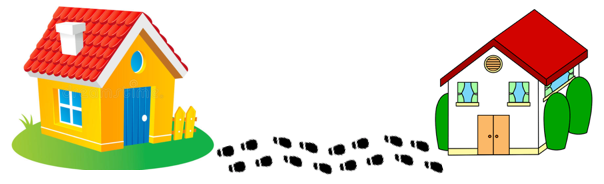
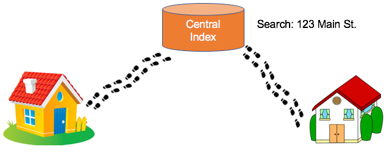

# Graph Storytelling

Unless you work at a Technology Company like Google, Amazon or Meta, your manager may not have an intuitive understanding beteen the differences in databases types.  They know that you put data in and get data out, but other than that, everything inside the database is kind of blurry.  Explaining the difference between a JOIN and a pointer hop is not their primary concern.  Yet, if you tell a story to them, they might be able to retell that story to the other key influencers in their department.

Graph storytelling has beome an essential tool for helping non-technical decision makers make the right decisions.  I have found that telling the right story at the right time to the right people is a make-or-break activity.  It makes the difference between successful adoption of EKGs and projects that are doomed to failure due to lack of executive support.

The following is a list of stories that I have used to help people understand the key differences between databases.  I hope you can use them, test them and give me feedback on the ones that work and the ones that do not work.  If you have other stories that you think would be helpful, please feel free to share them with me.

## Story #1: The Neighborhood Walk

This is a story that I introduced in 2017 when I was first promoting enterprise graph technologies within a large Fortune 10 company that had no experiences with graph databases.  It took me many months of trial and error to refine the story to make it crazy enough that people would remember it.  I also want to thank my friends a Neo4j for testing the story on their students and giving me feedback.

[The Neighborhood Walk Story](https://dmccreary.medium.com/how-to-explain-index-free-adjacency-to-your-manager-1a8e68ec664a)

Index-free adjacency is the most important concept we need to understand when learning about native graph databases. Native graphs have very different use-cases than non-native graph databases. Non-native graphs systems are usually layered on top of other databases that are not optimized for fast graph traversal. Having a clear mental model of these differences is essential to the writing a clear business justification of any Enterprise Knowledge Graph project. However, it is not enough just for you to understand index-free adjacency: you have to be able to explain it to your non-technical peers and most importantly your manager and anyone else that will authorize your project. We have developed a metaphor for explaining index-free adjacency that seems to work. We call it the “direct neighbor walk” metaphor. Here it goes:

Suppose you live next to a cute neighbor (lets call her Ann). And on Pi Day you want to take her a hot apple pie to impress her. You text Ann and ask her if she likes Apple Pie and she says “yes!”, so you bake her a pie and now you want to get it to her house quickly while the pie is still hot. So here are the steps (see Figure 1):

1. You walk out the door.
1. You point towards Ann’s house.
1. You walk directly over to Ann’s house, which takes about 30 seconds, and you give her the hot apple pie — and she loves it! Happy ending!

That is how native graph databases lookup adjacent nodes in a graph. They do a direct walk of memory. This is called pointer hopping. It is the fastest way computers have to look at relationships. To work graphs have direct physical RAM addresses from each node all the other neighboring nodes in the graph. Most importantly, these pointers are created when you load data, not when you query data. Figure 2 has a “logical” diagram of this graph:

Logical model of two neighbors with a pointer connecting related instances.

1. You walk out the door, but in the RDBMS world you are prohibited from walking to related items via pointers. You need to go to the Central Index.
1. Walk downtown to the DMV-like government building where they have a very long line stretching for blocks.
1. When you get in line and wait your turn. Wait times are estimated at 6 hours.
1. When you get to the front of the line you go to the search agent counter.
The search agent has a list of all the people in your town sorted by their address (called the index). They search the list (using a binary search algorithm). The problem is that there are a lot of people in your town and the more people there are, the longer the search takes. The search returns and they finally give you the GPS coordinates of your neighbor’s house.
1. You take these GPS coordinates, enter them them into your cell phone map and follow the directions to Ann’s house. In total, it takes you 1,000 times a pointer hop (say 8 hours) to get there.
1. When you get there the pie is cold. She gives you a low Net Promoter Score on Neighborhood.com. She posts: “Nice guy but it takes him forever to deliver pies”.

This story summarizes the difference between a native-graph implementation of a graph database and non-native variations that are layered on top of other databases. Native graphs take data that is logically connected via arcs or relationships and hard-wire the physical RAM addresses of these items into the node. Relationship lookups are fast! Related nodes are sometimes even stored next to each other in memory which maximize the chances that the data is already in your CPUs cache! As a result, you can “hop” between roughly a million nodes every second for each core you have on your server. If you have a typical server with 16 cores you can be evaluating 16 million hops per second. If you are using an Amazon x1e.32xlarge server with 128 cores you can get 128 million hops per second. And for those of you with NSA-scale budgets you can get a little Cray Graph Engine with 8,192 cores that will do 12.8 billion (Giga) Traversal Edges Per Second (GTEPS) on the graph500 SSSP benchmarks.

The thing to remember is that relational databases, ironically, are very slow at looking up relationships. They are sometimes called “row stores” because their primary design goal is fast row-by-row access. Why? Because early COBOL systems that read from punch cards read one card at a time. They were designed to group all the fields in their rows together. We ended up inheriting the COBOL flat-file designs and retrofitting relationship lookups later as an afterthought. So if you have a big flat file without any relationships then row-stores are really fast! And for simple flat files you don’t need to lookup relationships using a search function. What is worse is that each relational JOIN operation is a search that typically doubles as you double the size of your database — what is called an O(log(n)) binary search operation. And the more JOINs you have the slower you get. Relational databases excel at queries on small datasets that have uniform flat structure. Native graph databases include Neo4j, ArangoDB, OrientDB (now owned by SAS) and TigerGraph.

We don’t want to imply that their isn’t value to layering graphs on the top of other databases. If you are not looking for complex patterns in large data sets there can still be value to storing graph data in your existing infrastructure and using graph visualization tools to view structure. If your company has under 10,000 employees than viewing organizational charts with data from an RDBMS is fine as long as you can write the SQL queries to do this. A topic for a future blog post. There also might be other reasons like security or distributed data issues that might make non-native graphs systems more appealing.

To summarize: relational databases (called row stores) have a primary goal of fast row-by-row access of uniform data. Relationship lookup is considered a secondary goal. With a graph database, fast relationship lookup is always a primary goal. Relationships are a first class citizen.

This difference has an impact on how we design graphs. Unlike RDBMS systems we don’t design to minimize JOIN operations. We design graphs to minimize RAM so all our pointers fit nicely into RAM. Adding lots of relationships is not only fast but encouraged!

Finally, lets remember that there is no single ideal architecture in storing all types of graph data. Index-free adjacency also means that if you have nodes with a very large number of relationships (a.k.a. supernodes) there are many links that will need to be updated when you make changes. For example a social network with movie stars that have millions of followers will require millions of updates if they are removed. Granted, this might be a rare event on a specific type of network, but something to consider when looking at the trade-offs.

Does this metaphor work? Do you have another metaphor that explain index-free adjacency? Let me know in the comments.

