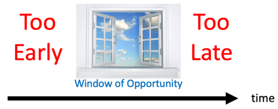

# Windows of Opportunity in Knowledge Graph Adoption

* Defining the EKG window of opportunity
* Necessary preconditions
* The EKG pitch deck
* The cost-benefit analysis
* The pilot project
* Testing scalability
* Taking advantage of a crisis

Most large organization goes through annual planning cycles.  Executives ponder how they can cut costs, raise sales and create new systems that might be more responsive to customer needs.

But it is rare that executives all sit around and say "we really need an enterprise knowledge graph".  From what I can tell, it has never happened.

Companies that successfully adopt enterprise knowledge graphs go through a series of stages before they embark on a pilot EKG project.  Once they do start the pilot project, the clocks usually begin ticking.  If the right preconditions are not met, the pilot may fail and the organization will quickly determine that the EKG is not a good fit for their organization.

This narrow time slot is called the [Window of Opportunity](../glossary.md#window-of-oppertunity) for EKGs.

Knowing how to recognize these windows and take advantage of them is a key skill we attempt to explore in this book.

## Necessary Preconditions

## Prepping the Pitch Deck
When I worked with Steve Jobs at NeXT computer one of my jobs was to prep events for Steve's presentations.  I learned important lessons on the value of preparation before you give a presentation.  Everything has to do with attention to detail and finding a message that will resonate with your audience.  People will respect you if you do a detailed analysis of their situation before you propose a solution.  

* Speak the language of the audience - start with their strategic objectives
* Doing your homeworks - knowing their pain points
* Knowing who they respect - what books do their leaders quote from?
* Using insider knowledge - what pain points will the developers share
* References - who else in the organization do they trust
* Managing emotions: fear and greed - fear they will be left out - greed for the bonus of cost reduction and better insights
* Knowing how much detail is enough

## The Cost Benefit Analysis

